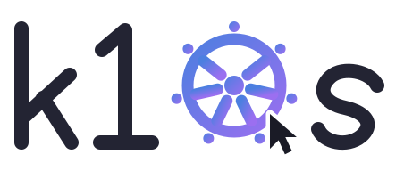
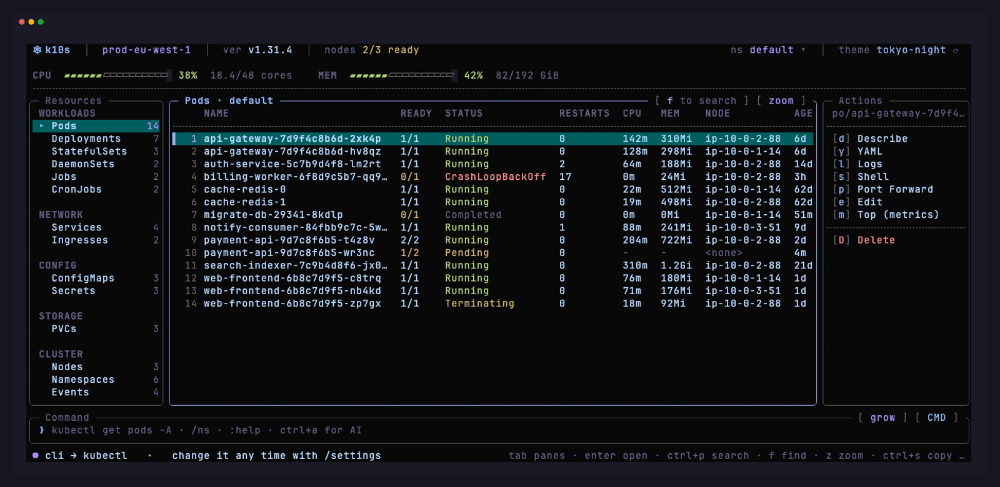

<div align="center">

<picture>
  <source media="(prefers-color-scheme: dark)" srcset="assets/logo/wordmark-on-dark.svg">
  
</picture>

### The Kubernetes terminal UI you can *click*.

**k9s taught us to live in the terminal. k10s makes that terminal
point-and-click, instantly searchable, themeable - and gives it an AI that
already knows your cluster, namespace and selected object.**

[](docs/roadmap.md)
[](go.mod)
[](#install)
[](#install)
[](docs/update.md)
[](LICENSE)
[](#contributing)

[Install](#install) · [Try it with no cluster](#try-it-in-30-seconds-no-cluster-required) ·
[Features](#what-you-get) · [k9s → k10s](#coming-from-k9s) · [Docs](docs/README.md) ·
[Build log](docs/build-in-public.md)

</div>

---

<div align="center">



<sub>A real terminal capture of `k10s` running - `just screenshot`, on the offline demo backend. Every frame in these docs comes out of the running binary, never hand-drawn.</sub>

</div>

## Why k10s

A cluster dashboard is something you open twenty times a day, usually while
something is on fire. The two things that matter are **how fast it opens**
and **how little you have to remember**.

- **Nothing is hidden behind memorised keys.** The actions that apply to the
  thing you selected are listed, right there, in their own pane. Click one,
  or press the letter next to it.
- **Your mouse works.** Click a row, click a pane, click `[ zoom ]`, click
  `ns default ▾`, scroll the table. Every border button is real.
- **One search box for the whole cluster.** `ctrl+p` searches resource kinds
  *and* objects together. No prefix language to learn.
- **It opens instantly.** Startup registers **zero** watches and waits for
  nothing - informers start lazily, per kind, the first time you look at
  one. Opening Pods watches pods, not every Secret and Event you own.
  ([how, and the regression guards](docs/performance.md))
- **AI that can see the screen.** `ctrl+a`, ask in plain English. The current
  context, namespace, kind and selected object are injected into the prompt,
  so "why is this pod unhealthy?" means *this* pod.
- **It updates itself.** `/update` installs the newest release over the
  running binary - checksum-verified, atomic, offers to restart into it.

## Try it in 30 seconds (no cluster required)

k10s ships an offline demo backend. No kubeconfig, no cluster, no risk - you
get a realistic cluster to click around in, including a CrashLoopBackOff to
poke at.

```bash
git clone https://github.com/p10node/k10s && cd k10s
go run .          # no cluster reachable → offline demo mode
```

The same binary connects to your real cluster the moment one is reachable.
There is no flag to remember: `main.go` builds the live client-go backend and
falls back to the demo only if that fails.

## Install

```bash
curl -fsSL https://p10node.com/k10s/install.sh | sh
```

macOS and Linux, `amd64` and `arm64`. It picks the right prebuilt binary,
verifies its sha256 against the release manifest, and installs it into
`/usr/local/bin` (or `~/.local/bin` when that needs a password it cannot
ask for). `--dir`, `--version` and `--no-sudo` are in [docs/install.md](docs/install.md),
along with how to read it before you run it and the matching
`uninstall.sh`.

With Go on the box:

```bash
go install github.com/p10node/k10s@latest
```

Or from a clone, which also stamps the version into the binary:

```bash
git clone https://github.com/p10node/k10s && cd k10s
just install                 # → $GOBIN/k10s, version-stamped
```

Prebuilt static binaries for **darwin/amd64, darwin/arm64, linux/amd64,
linux/arm64 and windows/amd64** are published on every tag — Windows is the
one platform the installer script sends to the
[release page](https://github.com/p10node/k10s/releases) instead. Every later
upgrade is just:

```bash
k10s update
```

Then run it:

```bash
k10s                  # your current kubeconfig context
k10s --version        # which build is this
```

## What you get

### Every resource, grouped the way you think about them

16 kinds across **Workloads · Network · Config · Storage · Cluster · Custom
Resources**, each with a live row count for the current namespace. Your CRDs
are discovered automatically - no configuration.

Pods · Deployments · StatefulSets · DaemonSets · Jobs · CronJobs · Services ·
Ingresses · ConfigMaps · Secrets · PVCs · Nodes · Namespaces · Events · CRDs ·
Custom Resources

### The whole day-2 toolkit, on single keys

|                                    |                                                                   |
|------------------------------------|-------------------------------------------------------------------|
| `d` describe                       | real `kubectl describe` output, from the API                      |
| `y` YAML                           | the live object                                                   |
| `l` logs                           | **follows** (`-f`), newest at the bottom, scroll back 500 lines   |
| `s` shell                          | a real interactive exec session - raw TTY, resize-aware, in-panel |
| `p` port-forward                   | real SPDY forward, start/stop from the pane                       |
| `m` top                            | pod/node metrics, per container, with requests vs limits          |
| `e` edit · `r` restart · `c` scale | rollout restart, scale, `$EDITOR`                                 |
| `o` / `u`                          | cordon-uncordon / drain - offered only when Nodes is selected     |
| `D` delete                         | red confirm modal, because it should be scary                     |

### Logs that follow, in the pane you were already looking at (`z` to zoom)

```
╭─ logs -f billing-worker-6f8d9c5b7-qq91x ────────────────────────────────── [ close ] [ restore ] ╮
│   8 2026-08-25T08:12:18.331Z INFO  http          GET  /v1/users/me         200 3.1ms             │
│     trace=44b1e2f9                                                                               │
│   7 2026-08-25T08:12:21.660Z INFO  worker        flushed batch size=250 dur=41ms                 │
│   6 2026-08-25T08:12:25.019Z INFO  http          GET  /healthz             200 0.3ms             │
│   5 2026-08-25T08:12:31.402Z INFO  http          DELETE /v1/sessions/9a1   204 5.7ms             │
│     trace=7c0d19ba                                                                               │
│   4 2026-08-25T08:12:33.881Z WARN  gc            pause=18ms heap=412Mi                           │
│   3 2026-08-25T08:12:40.117Z INFO  http          GET  /v1/orders/88213     200 7.4ms             │
│     trace=e21f8b05                                                                               │
│   2 2026-08-25T08:12:44.590Z INFO  metrics       scrape ok series=1842                           │
│   1 2026-08-25T08:12:51.008Z INFO  http          GET  /healthz             200 0.3ms             │
│ ● following  newest at bottom                                        500 loaded · ↑ for older    │
╰──────────────────────────────────────────────────────────────────────────────────────────────────╯
```

### An AI prompt that already has the context

```
╭─ Prompt · plain text → AI · /commands still work · esc close ─ [ grow ] [ AI · claude-sonnet-5 ] ╮
│ ✦ ask about your cluster…   ·   /settings to change provider/model                               │
╰──────────────────────────────────────────────────────────────────────────────────────────────────╯
 ● AI mode — plain text goes to claude-sonnet-5    tab panes · enter open · ctrl+p search · f find…
```

`ctrl+a` toggles it. Bring your own key - **OpenAI-compatible** (so also
Groq, Together, OpenRouter, vLLM, Ollama, LM Studio, any local gateway) or
**Anthropic**. Answers open as a normal text view you can scroll, zoom and
close. No cluster data leaves your machine unless you press enter in AI
mode. The only other network call k10s makes on its own is the once-a-day
update check, which asks GitHub for a version number and nothing else.

### Seven themes, previewed live before you commit

`tokyo-night` (default) · `catppuccin-mocha` · `dracula` · `nord` ·
`gruvbox-dark` · `solarized-light` · `matrix`

`T` cycles, `/theme` opens a picker that **applies each theme as you move
through the list** - you judge it on the real UI, not on a name - and `esc`
puts back whatever you had. No hardcoded color exists anywhere in the render
path, so [adding a theme is one struct](docs/themes.md).

### Details that only show up after a long day

- **Copy mode** (`ctrl+s`) releases the mouse so your terminal can drag-select
  and copy - the one thing every mouse-capturing TUI breaks.
- **An honest loading state** instead of "no resources found" while a watch
  is still syncing.
- **Namespace and context pickers that never ask you to type a name.**
- **First-run onboarding** asks what you call kubectl (`kubectl`/`k8s`/`k`/
  your own alias) and uses it in every hint from then on.
- **A grow-able prompt** (`ctrl+z`) - because a long kubectl line or an AI
  question does not fit in a one-row field that scrolls sideways.
- **A terminal-too-small notice** instead of a garbled layout.

## Coming from k9s

k10s exists because of [k9s](https://github.com/derailed/k9s). Credit where
it is due: k9s is mature, enormous in scope, plugin-extensible, and it is the
reason a whole generation of us stopped typing `kubectl get pods` all day.

k10s is younger and deliberately narrower. The difference is philosophy:

|               | k9s                                             | k10s                                                         |
|---------------|-------------------------------------------------|--------------------------------------------------------------|
| Primary input | keyboard-first, command-driven                  | **mouse *and* keyboard, equally**                            |
| Discovery     | you learn the commands                          | **the actions for the selected object are listed on screen** |
| Search        | per-view filter, plus `:` to jump between views | **one box (`ctrl+p`) over kinds *and* objects**              |
| AI            | plugin territory                                | **built in, with cluster context injected**                  |
| Scope         | very large, plugin ecosystem                    | **small, opinionated, no plugins**                           |
| Upgrades      | your package manager                            | **`k10s update`, self-replacing**                            |

**Use k9s if** you want the biggest feature surface, a plugin ecosystem, and
years of production mileage. **Use k10s if** you want something you can hand
to a teammate who has never opened a TUI, and have them find `logs` on their
own in ten seconds.

## Keys

The short version - the [full reference is here](docs/keybindings.md).

| Key                                    | Action                                               |
|----------------------------------------|------------------------------------------------------|
| `tab` / `shift+tab`                    | cycle panes                                          |
| `↑↓` (`j`/`k`) · `pgup/pgdn` · `g`/`G` | move · page · first/last                             |
| type (Resources focused)               | instant kind filter · `esc` clears                   |
| `f`                                    | find: search every column of the open table          |
| `ctrl+p`                               | **search everything** - kinds and objects in one box |
| `enter` / double-click                 | open it: logs if it has them, else describe          |
| `z`                                    | zoom / restore the centre pane                       |
| `:` / `/`                              | command prompt (with a suggestions popup)            |
| `ctrl+a`                               | AI prompt mode ✦                                     |
| `T` / `ctrl+t`                         | cycle themes                                         |
| `ctrl+s`                               | copy mode - release the mouse to select & copy       |
| click / wheel                          | anywhere in a pane selects it, blank space included  |
| `q` / `ctrl+c`                         | quit                                                 |

## Commands

Two prefixes, and each one only ever shows its own set. **`/` does
something. `:` narrows what is on screen.** `enter` runs the highlighted
suggestion immediately - no second trip through the prompt.

```
/ns   /context   /theme   /settings   /update   /version   /help
:search <term>   :filter <term>   :scale <n>   :mouse
```

None of `/ns`, `/context` or `/theme` takes a name - each opens a chooser
showing what actually exists. [Full command reference](docs/commands.md).

## Config

Theme, context, namespace, AI settings and the update check persist to
`~/.k10s/config.yaml` (override with `K10S_CONFIG`), saved on every change.
See [config.md](docs/config.md).

> **Note:** the AI API key is stored as plain text in that file (mode 0600)
> and masked in the UI. If that is not acceptable in your environment, leave
> it empty and AI mode simply stays off.

## Docs

|                                                                                   |                                                               |
|-----------------------------------------------------------------------------------|---------------------------------------------------------------|
| [architecture.md](docs/architecture.md)                                           | packages, the `Source` boundary, render pipeline, mouse zones |
| [performance.md](docs/performance.md)                                             | lazy watches, cheap counts, and the guards that keep it fast  |
| [ui.md](docs/ui.md)                                                               | layout, panes, focus, zoom, overlays                          |
| [keybindings.md](docs/keybindings.md)                                             | full key + mouse reference                                    |
| [commands.md](docs/commands.md)                                                   | prompt modes, slash commands, AI settings                     |
| [themes.md](docs/themes.md)                                                       | theme list, picker, palette contract                          |
| [config.md](docs/config.md) · [update.md](docs/update.md)                         | what persists · how self-update works                         |
| [backends.md](docs/backends.md) · [dev.md](docs/dev.md)                           | live vs demo backend · build, tests, headless renderer        |
| [roadmap.md](docs/roadmap.md)                                                     | what is done, what is missing, and the known limits           |
| [marketing.md](docs/marketing.md) · [build-in-public.md](docs/build-in-public.md) | how this project is being shared                              |

## Contributing

The barrier is low on purpose. `just` lists every recipe:

```bash
just dev            # run from source
just shot 140 44    # render one frame headlessly - no TTY, no cluster
just screenshot     # capture the README hero from a real terminal (vhs)
just check          # fmt + vet + test, in the order that fails fastest
```

`cmd/shot` is why UI work here is pleasant: you can iterate on layout, replay
keystrokes (`just shot 140 44 j,j,d`) and diff frames without a terminal or a
cluster. Nothing in these docs is drawn by hand - the frames come from that
renderer, the hero image from `just screenshot` driving the real binary in a
real terminal.

Good first issues live in [roadmap.md → possible next
steps](docs/roadmap.md#possible-next-steps): more kinds, click-to-sort
columns, multi-select bulk delete, grep inside the log stream, saved views.

**Honest status:** every live path is implemented against the real
client-go/kubectl APIs and covered by tests with fake clientsets, but this
tree has not yet been smoke-tested against a production cluster by its
author. Try it on `kind` first. The known limits are listed
[in the roadmap](docs/roadmap.md#known-limits) rather than buried.

## Thanks

To my colleagues - the people whose questions, over-the-shoulder debugging
sessions and "can you just check if that pod is up?" pings are the entire
reason this exists. k10s was not built to be a project; it was built so that
looking at our clusters would stop being the annoying part of your day. Every
pane in it is an answer to something one of you asked me. Thank you for the
inspiration, the patience, and for being the first users.

> *Cảm ơn các đồng nghiệp của tôi - repo này được viết ra để phục vụ các bạn,
> và chính các bạn là nguồn cảm hứng cho k10s.*

To [@derailed](https://github.com/derailed) and **k9s**, for proving a
Kubernetes TUI could be something you actually want to open.

To [Charm](https://github.com/charmbracelet) - **Bubble Tea**, **Lip Gloss**,
**Bubbles** - and to [BubbleZone](https://github.com/lrstanley/bubblezone),
which is the reason any of this is clickable at all.

## License

[Apache-2.0](LICENSE) - the same license as Kubernetes, Helm and k9s. Use it,
fork it, ship it inside your company.
